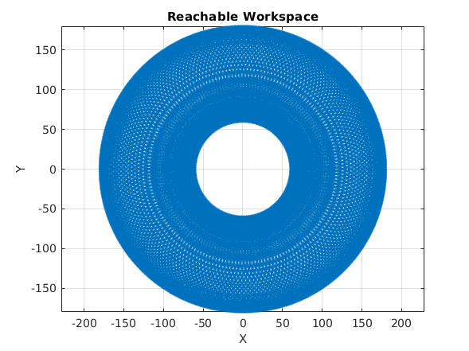
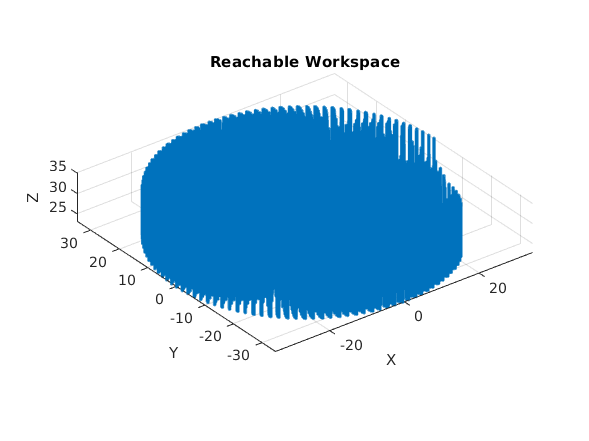

# Robotic Arm Workspace Plotter
This is the repository for a [Matlab add-on](https://la.mathworks.com/matlabcentral/fileexchange/131239-2d-and-3d-robotic-arm-workspace-plotting) that allows plotting the reachable workspace 2D and 3D robotic arms using the [DH parameters](https://en.wikipedia.org/wiki/Denavit%E2%80%93Hartenberg_parameters).

# Quickstart

## 2D Example
Here's a basic example for plotting a 2D robot's workspace via `plot2dworkspace.m`:
```Matlab
syms theta1 theta2 theta3 real
syms d1 d2 real

% DH parameters
test_dh = [0 0 0 theta1; ...
           120 0 0 theta2; ...
           60 0 0 0]
% Parameter ranges
theta1_range = linspace(0,2*pi, 180);
theta2_range = linspace(0,2*pi, 180);
test_map = containers.Map({'theta1', 'theta2'},{theta1_range,theta2_range});

% Workspace plotting function
plot2dworkspace(test_dh, test_map)
```

Which will render as follows:
<p align="center">
  
</p>

For more examples, see [/examples](/examples).

## 3D Example
Here's a basic example for plotting a 3D robot's workspace via `plot3dworkspace.m`:
```Matlab
syms theta1 theta2 theta3 theta4 theta5 theta6 real
syms d1 d2 d3 d4 real

% DH parameters
test_dh = [18.5 0 42 theta1; ...
           16 pi 0 theta2; ...
           0 0 d3 0; ...
           0 0 7 theta4]
% Parameter ranges
theta1_range = arr2Rad(linspace(0,300, 50));
theta2_range = arr2Rad(linspace(0,300, 50));
d3_range = linspace(0,12, 50);
% Note the specification states 540°, but anything past 360° is redundant
theta4_range = arr2Rad(linspace(0,360, 50));
test_map = containers.Map({'theta1', 'theta2', 'd3','theta4'}, ...
    {theta1_range, theta2_range, d3_range, theta4_range}); 
% Workspace plotting function
plot3dworkspace(test_dh, test_map, @get_alternative_dh_transform)


function out = arr2Rad(A)
    out = arrayfun(@(angle) deg2rad(angle), A);
end

function T = get_alternative_dh_transform(a,alpha,d,theta)
T = [cos(theta) -cos(alpha)*sin(theta) sin(alpha)*sin(theta) a*cos(theta)
     sin(theta) cos(alpha)*cos(theta) -sin(alpha)*sin(theta) a*sin(theta)
     0 sin(alpha) cos(alpha) d
     0 0 0 1];
end
```

Which will render as follows:
<p align="center">
  
</p>

For more examples, see [/examples](/examples).

# Notes
- **Performance** - this add-on uses a brute-force method that calculates the end-effector's position for every possible DH parameter combination. While reasonably well-optimised this can become expensive quickly. For example, if you have a 6 DOF robot and want to explore 20 possible values per parameter, this will take $20^6 = 64,000,000$ operations and units of memory.
- **DH Parameter Convention** - there are conventions to construct the DH transformation matrix, based on the order of the individual transforms for the DH parameters. By default this add-on uses the one [here](helpers/get_DH_matrix.m), but it is possible to provide an alternative function that returns a different matrix (see above 3D example).
